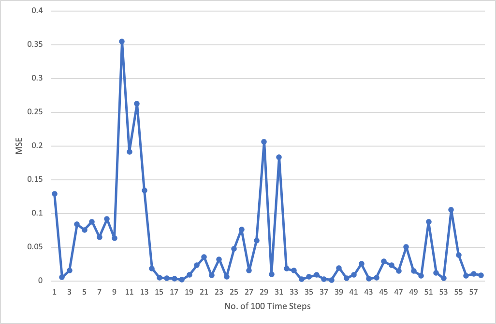

# Reflection

This Refection writeup provides general descriptions on how I developed the codes for implementing PID control in the Udacity simulation workspace, and how I calibrated the hyper-parameters through both manual and twiddle methods.

## 1. Development of Codes

### PID Class

The PID Class is aimed to implement the entire PID control process. I have expanded the template (provided in the workspace) into a base algorithm which is elaborated below. Note that variables and functions defined for the twiddle method will be described in Section 3 of this writeup.

Variables defined for this Class include:

- `p_error, i_error and d_error`: errors related to p, i and d respectively.
- `Kp, Ki and Kd`: PID coefficients for p, i and d respectively.
- `cte, prev_cte, diff_cte,int_cte` cte error, previous cte error, error difference between current and previous cte and the total cte error.

Functions defined for this Class include:

- `Init(Kp_, Ki_, Kd_)`: initiate PID coefficients.
- `UpdateError(cte)`: update PID errors based on cte.
- `TotalError()`: calculate and return the total error/steering value.

### First Run

To kick off the first run of the PID controller, I have adopted the set of PID coefficients introduced in the course: P=0.2, I=0.004, D=3.0, respectively. The simulation result showed that the vehicle was able to successfully drive a lap around the track, even through the trajectory of the vehicle was a bit swinging within the lane of the track. The video of this first run can be find [here](./Videos/PID_0.2_0.004_3.mov).

## 2. Fine-tuning of Hyperparameters Manually

In order to make the vehicle drive more smoothly compared with the first run (based on the set of PID coefficients P=0.2, I=0.004, D=3.0), I have manually fine-tuned the hyperparameters, i.e., P, I and D, respectively. A parametric study was conducted based on different combinations of hyperparameters as shown in the table below:

| No       	| P   	| I     	| D   	|
|----------	|-----	|-------	|-----	|
| 0 (base) 	| 0.2 	| 0.004 	| 3.0 	|
| 1       	| 0.3 	| 0.004 	| 3.0 	|
| 2       	| 0.1 	| 0.004 	| 3.0 	|
| 3       	| 0.2 	| 0.005 	| 3.0 	|
| 4       	| 0.2 	| 0.003 	| 3.0 	|
| 5       	| 0.2 	| 0.004 	| 4.0 	|
| 6       	| 0.2 	| 0.004 	| 2.0 	|

An video showing the driving results for the sets of hyperparameters above can be find [here](./Videos/All.mp4).

As shown in the video, it's hard to identify the differences among those results since all of them show the car successfully driving on the track. Therefore, the twiddle method was adopted to further fine-tune hypermarameters as described in the next Section.

## 3. Fine-tuning of Hyperparameters Using the `Twiddle` Method

In order to implement the Twiddle method, I have expanded the PID Class as following:

### PID Class Expansion

Variables defined for this Class include:

- `int iCounter`: track the current time steps.
- `int N`: sample size to calculate MSE, for this project, N = 100.
- `vector<double> VectCTE`: vector of ctes, note that the size of the vector is N.
- `vector<double> Vect_P`: vector of [P, I, D] with initial value [0.2, 0.004, 3].
- `vector<double> Vect_dP`: vector of [dP, dI, dD] with initial value [0.1, 0.001, 1].
- `int idx`: index of current hyperprameters being fine-tuned.
- `double best_error`: current best error.

Functions defined for this Class include:

- `double MSE()`: calculate mean squared error (MSE) of the latest N ctes.
- `void UpdateP(P)`: update PID values.
- `void Twiddle()`: Twiddle function to fine-tune hyperparameters. Note that the algorithm developed here is a bit different from that in the course: 1) stopping criteria is set as max. 60*N = 6,000 time-steps; 2) two bool variables - flag2 and flatNext - are defined to control the entire fine-tuning process since it needs to wait until next MSE is calculated from the simulation.

### Simulation results

I have applied the twiddle method in the simulation environment and below shows the changes of MSE against the number of every 100 time-steps:

Although the chart shows a bit fluctuation in MSE values along the simulation process, the overall trend of the MSE value is still decreasing along with time. The fluctuation may due to the site conditions in the simulation where the track is not constantly straight, therefore the MSE values calculated varied from time to time.

